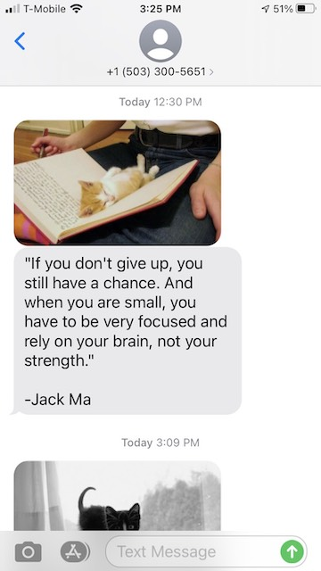

# Quote Messager

This is a dumb program that uses golang to fetch the quote of the day from `http://quote.rest/` and then uses twilio to send it to my phone.  The real value of it is that it's a simple thing that can be served up via k8s in a cronjob.

Starting in v2, I've add the [CatAPI](https://thecatapi.com/) as bonus picture inside the message.



### Building

`go build`

### Testing

`go test -v ./...`

### K8s

The real value of this is deploying it to kubernetes as a cronjob and then looking to add prometheus push gateway metrics.

#### Kustomization

This was my first foray into kustomizing.  I created a base, overlay, and two separate secrets such that deployment of all resources can be done together as well as having separate **sealed** secrets (in this case, phone numbers) for dev and prod.

#### Gotchas with SealedSecrets and Kustomization

Because SealedSecrets use the name and namespace and all other data about the secret to create the hash, you have to make a complete replica of the secret using the "-dev" suffix, but then set the kustomization selector to the original label of the secrets.

### Applying with Kustomize

dev:
`kubectl apply -k ops/overlays/dev`

prod:
`kubectl apply -k ops/base`

### Secrets

The phone numbers to text as well as the twilio api key are obscured as secrets.  Set them as environment variables for local testing:

```shell
TWILIO_AUTH=api-key PHONE_NUMBERS=+16666666666,+16666666666 go run .
```